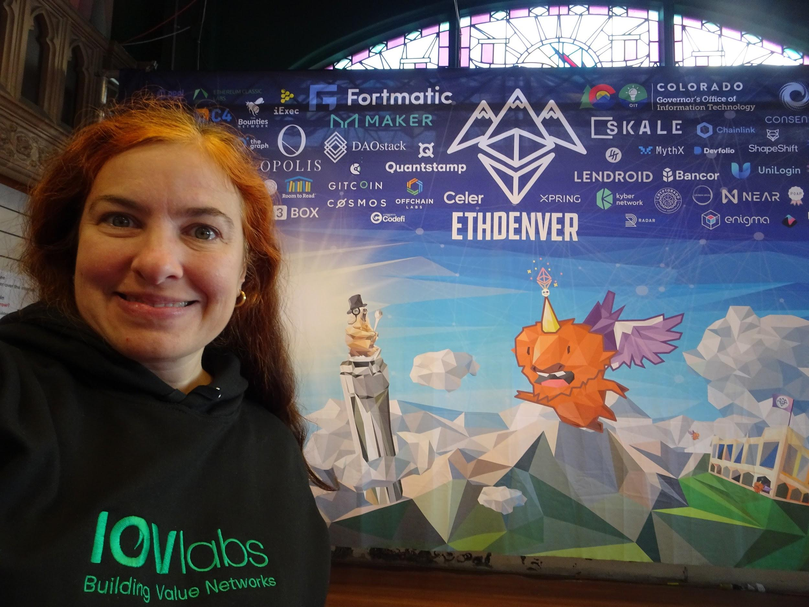
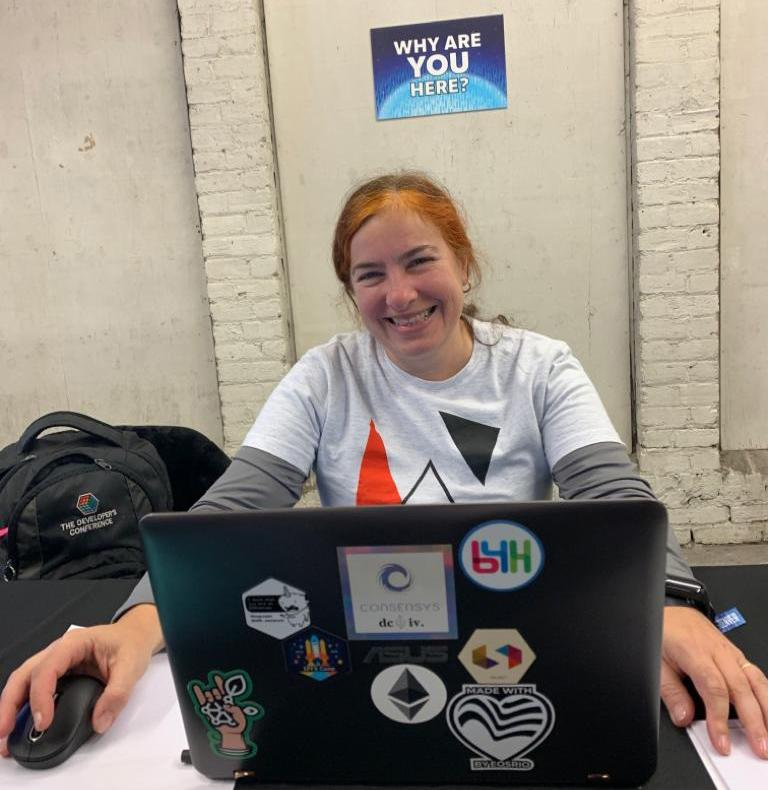
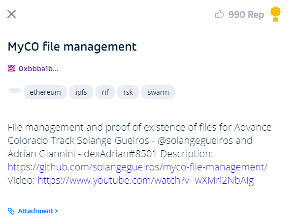
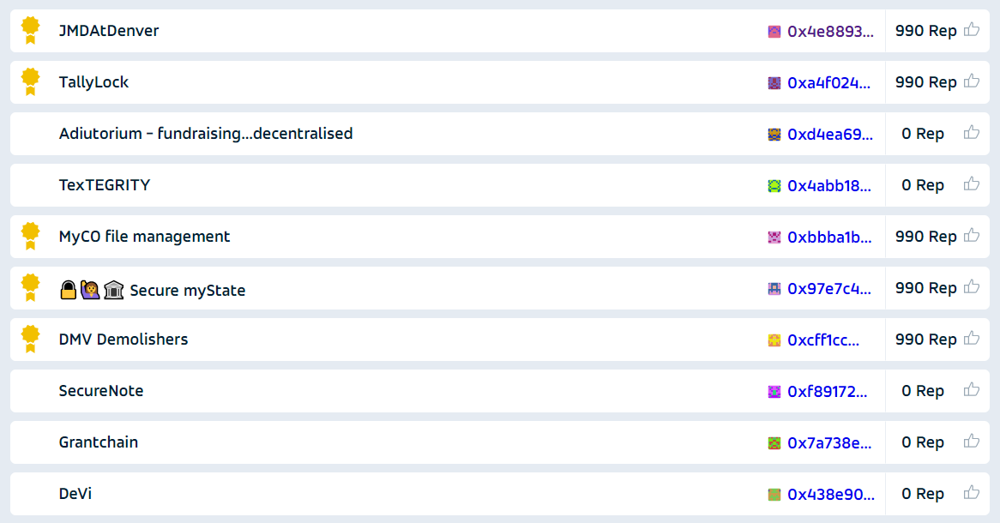

 

# State of Colorado challenges

It is amazing for me to have a government of State at EthDenver’s sponsors!

They described some use cases and you can choose one of them.

Here the announcement:

The State of Colorado needs your help to build and fulfill the following use cases! These are a little different from Sponsor Bounties in that:

* they are more prescriptive so you can start building quicker

* if you enjoy working on it, there's opportunity to continue the work after ETHDenver!

Source: 
[Alchemy > All DAOs > Advance Colorado DAO > Competition > Competitions > State of Colorado Use Cases](https://alchemy-xdai.daostack.io/dao/0x804dbac130778ec5b769115dc6bea9ff85237a07/crx/proposal/0xd29e3ce2bbdefbacab27863eeeafa33bb1c71f48730dbb01c8354e98475436c4)

There are 4 different use cases:

1- [myColorado : Registry Use Cases (3 tabs)](https://docs.google.com/spreadsheets/d/16ARzLUcmE4ZCXuX5kUGEpGd-gNdCqrJwNHmpa3OndAA/edit#gid=1913166276)

2- [myColorado : Blockchain-based messaging system Use Case](https://docs.google.com/spreadsheets/d/1tQBvWCcojdBAWkAXoOZXSAdHlOAhcVdnjboWKRwaldM/edit#gid=1913166276)

3- [DoA/CHAMP/OIT : Hemp Regulatory Compliance Use Case](https://docs.google.com/spreadsheets/d/1JDaDzBpEmFdiTxpNM1IW7j5wYvxyPmJJqaBUvbIDSBU/edit#gid=1472437640)

4- [DoRA/OIT : Professional Licensing Use Cases](https://docs.google.com/spreadsheets/d/1cf6t-Vvbfx3lCYNdt8nhRVsIBQ9E6FRf1wGwCGAWyyw/edit#gid=1634795270)

 

# My choice: myColorado - registry use cases

I chose this challenge to build something for them. I covered the three parts of it:

### Submit Registry

A Web-based service that allows a user to upload a file and contact information.  The service will create a hash of the file and publish it to multiple blockchains, push the file to an S3 bucket or other accessible storage and return the hash, an address to the recorded file and the addresses in the blockchains.

### Confirm Registry

A Web-based service that allows a user to upload a file and determine whether or not the file has been registered already. If found, it will return the registrant information, timestamp, blockchain proof addresses, and a URL for the original file.

### Confirm Hash

A Web-based service that allows a user to upload a file hash and determine whether or not the source file has been registered already. If found, it will return the registrant information, timestamp, blockchain proof addresses, and a URL for the original file.

For extra information [click here](https://docs.google.com/spreadsheets/d/16ARzLUcmE4ZCXuX5kUGEpGd-gNdCqrJwNHmpa3OndAA/edit#gid=1913166276).

# MyCo file management

My group / project is MyCo file management.

I didn’t have a teammate at the beginning but after I found Adrian Giannini, from dexFreight, who did not have intention of making a project, so I invited him to participate with me only to review my project.

## Project overview 

There are 2 parts:

1. Upload / download of files
2. Blockchain registry / management of files

## Upload / download of files

I used RIF Storage, from IOV Labs, to upload / download files.

RIF Storage is an open, censorship resistant, permissionless and decentralized storage protocol. It provides a unified interface to 3rd party decentralized storage providers, in my case, IPFS and Swarm.

Interested in learning more about RIF Storage? [Click here](https://developers.rsk.co/rif/storage/)

The files are published at two decentralized storage systems:

* IPFS
* Swarm

Doing the upload, automatically it will register information on a blockchain.

I also implemented the download of files by hash.

## Blockchain registry / management of files 

To manage the contact information about the owner of the file, I built a smart contract called CoFiles with some structs to index the file and the contact data and some functions to interact with them.

When someone tries to upload a file, it must be filled with the person’s email and the file will be linked to the address (wallet) used to publish it.

MyCo is saving at blockchain these personal data from registrant:

* Address (wallet)

* Email

Other information can be included too.

This architecture, with the same smart contract, can be used with these Blockchains:

* Ethereum

* RSK

Call function addFile at smart contract CoFiles will add the data to struct and indexed variables,  and after upload file using RIF covers "Submit Registry" feature.

"Confirm Registry" is implemented in the smart contract function getOwnerFile. First it is necessary to generate the hash of a file at the front end and after call the function, verifying if the file has been registered already based on data structure of smart contract. If a file was already registered, it will return the address and email from the registrant. If not published, fow now it shows an error, but can be resolved in the future.

If the user already has the hash of a file and submit it the smart contract function getOwnerFile, it returns information about the file's owner, and it is possible to "Confirm Hash".

I did not have time to do the final front end with integrations. The main flow is to have a screen which calls the smart contract functions to verify if the file was stored before, do the storage simultaneously on both IPFS and Swarm, and another screen to verify file and hashes with download option.

## Thanks

I would like to say thank you to Vojtěch Šimetka, who provided me with some material about RIF storage and to Adrian Giannini, who was my teammate.

## Links

Source code at Github:

[https://github.com/solangegueiros/myco-file-management/](https://github.com/solangegueiros/myco-file-management/)

Video about the project:

[https://www.youtube.com/watch?v=wXMrl2NbAIg](https://www.youtube.com/watch?v=wXMrl2NbAIg)

Here are a screenshot of my submission:

 

# State of Colorado - Submissions

They received 10 submissions:

On the left side, the winners have this symbol: 

So MyCo file management was recognized by the State of Colorado, and the project won this bounty.

 

# EthDenver winners

The bounties of sponsors are not announced on stage, so I didn't get to go on stage to be recognized. 

:(

They did, however, publish this article on [medium](https://medium.com/@ETHDenver/the-ethdenver-2020-finalists-buffidao-bounty-winners-627fd1b2427a)

[Click here](https://docs.google.com/presentation/d/1B69gPFPybDMZr9Xu9eG7SfGeGLhK7czH71GJo4JhvAk/edit#slide=id.g7dcbceb523_0_145) to see all the winners for each sponsor.

 

# Wrap up

For me, EthDenver is one of the most difficult hackathons to build a project. It is so big, with a lot of competitors, and one of the best places to learn, because of the high quality of the talks and workshops. Or I hack, or I learn the lessons…and it also has a lot of moments to relax and be fun. It is hard to do  everything :)

I choose to be focused on my project, from 8 pm on Friday until 8 am on Sunday I sleeped only 6 hours in total, and passed the rest of time trying to build the things… Some parts are easier, like the smart contract, others terrible, like to do the front end… But, when I delivered, even if it was not all finished, I was so proud to do it.

I am working as a developer advocate at IoV Labs and I decided to build something using the company's tools. I think that an important achievement of this was IOV Labs gained recognition from the State of Colorado government.

On Monday before the hackathon IoV Labs organized a meetup / workshop with our tools, and one of their representatives did it. We closed the events week by developing a project for them, demonstrating our interest and ability to serve them.

I had a great time at EthDenver!

# The end