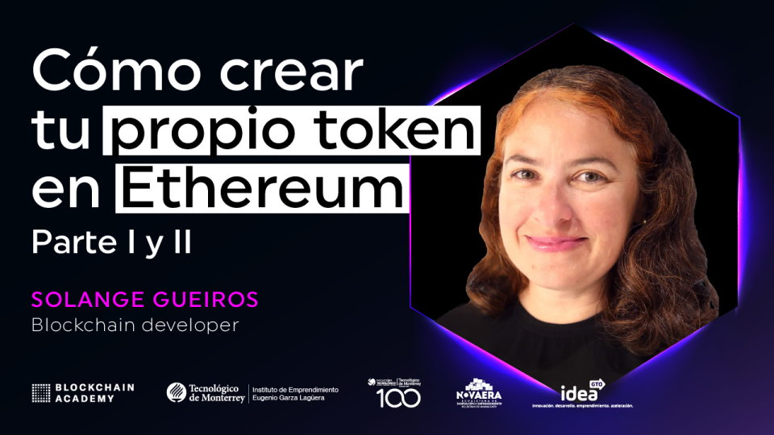
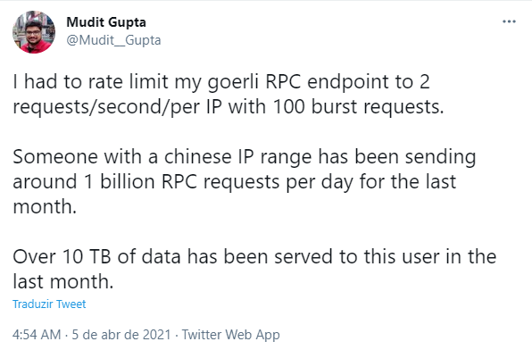

## Blockchain and smart contracts live teaching adventures

Last week - 19th and 20th of April/2021, I was invited by Blockchain Academy Mexico to give a workshop in Spanish to the Instituto Tecnológico de Monterrey.
The theme was "How to create your own token in Ethereum".

I really like using the framework [Truffle](https://www.trufflesuite.com/truffle) with beginning students, because it facilitates some tasks.
In addition, to create tokens, I use the [Open Zeppelin](https://openzeppelin.com/contracts/) library, 
because smart contracts were created by this auditing and security company.

On the first day of class we installed all the prerequisites and taught how to create the first smart contract using [Remix](https://remix.ethereum.org/), another fantastic online IDE.
We created a basic smart contract, to register and present information recorded on the Blockchain.
The next day, with everything ready, the schedule was to create the token.
Students would have plenty of time to interact with the tokens they created.

But it was not like that :(

### Embarrassing Live Blockchain Teaching

I often say that giving hands on lessons about smart contracts is to live dangerously!

This Blockchain world evolves very quickly:

- The tools release new versions, which are not always compatible with the previous ones.
- The Solidity compiler is constantly updated.
- Smart contracts created in one version cannot always be compiled in another.

And… I feel ashamed trying to teach things that I've done before, but that don't work anymore :(

<iframe src="https://giphy.com/embed/eP1fobjusSbu" width="100%" height="100%" style="position:absolute" frameBorder="0" class="giphy-embed" allowFullScreen></iframe>

<a href="https://giphy.com/gifs/shame-for-box-of-eP1fobjusSbu">via GIPHY</a>

One of the most striking times for me was in December 2018, when Truffle changed the version from 4 to version 5.
I was teaching a course at the Blockchain Academy Brasil in Brasília, for Dataprev, 
a public agency that develops several systems for the Brazilian government, which is fundamental in identifying citizens and companies.

A week before I had reviewed the lesson plan and tested all the exercises, I was sure everything was working.
But I was teaching right on the day Truffle version 5 was released!
And the simplest command to create a project no longer worked.
I still had no experience with this type of problem, where something is changed in the environment, out of your control, and nothing else works...
I spent the night and until dawn trying to find out what was going on, until I got a solution for the class on the next dis.

This has happened on the way before.
To try to avoid it, I often review the class on the same day, "at the last minute".
This is not a lack of planning, it is just the opposite.
This way there is less chance of something being updated on the way :)

### Tips to avoid version problems in your projects:

Some tips to avoid these problems:

- When installing npm packages, always save the installed version.
- When creating smart contracts, define an exact version of the solidity compiler
- Also note the global versions of the tools used.

### Returning to the tokens workshop

To create tokens, I have already changed the way I teach a few times.
Now I was using a project from last year, but with the versions saved for all packages.
I was calm, I taught this workshop at the beginning of the month.
I didn't think I would need to do a last-minute check.
But… at the Instituto Tecnológico de Monterrey workshop I went through this problem again :(
I didn't do a review on the same day.

So ... what has changed this time?
The node configured in the project, where the publication is made on the Ethereum Blockchain.

We managed to create the token at the end of the class, using a workshop I gave in January 2018 at Campus Party Brasil.
We made the publication using Remix.
Students created their tokens, exchanged tokens with each other and I believe they were happy :)

But I confess that I was frustrated.
I reviewed several points of the project, and I couldn't find the error.
Publishing on other networks worked.
I did not imagine that I would have a problem with the knot used in the project.
I did some research to find out who was responsible for the knot, and found out it was Mudit Gupta.
Some more research and I get to his twitter, where I find this post:

[https://twitter.com/Mudit__Gupta/status/1378979226590670852](https://twitter.com/Mudit__Gupta/status/1378979226590670852)

Unfortunately, someone abused the node that he kindly provided at no cost to be used freely.
For this reason, he changed the number of requests per second, and this caused the problem with Truffle,
which makes many queries to the node during the process of publishing a smart contract.

I sent a message to him, and received a very quick and very kind reply!
He provided me with another link where I can continue using his node in class :)

I changed the URL and I was very happy to try the deploy process again.
But ... no sucess again!

<iframe src="https://giphy.com/embed/10ECejNtM1GyRy" width="100%" height="100%" style="position:absolute" frameBorder="0" class="giphy-embed" allowFullScreen></iframe>

<a href="https://giphy.com/gifs/dog-angry-doge-10ECejNtM1GyRy">via GIPHY</a>

With the new node, the older versions which I used before do not work anymore.
This was related to a security update on the Ethereum Blockchain, [EIP-155](https://eips.ethereum.org/EIPS/eip-155).

And here are the new actions:

- I changed the version of hdwallet-provider.
- I took the opportunity to update the smart contracts as well.
- I added new parameters in the Truffle configuration.

I finally managed to publish the **Sol token box** on the testnet [Goerli](https://goerli.net/) of Ethereum!

### Final considerations

Here is the updated tutorial:

[Truffle box token - Solange Gueiros](https://ethereum.solange.dev/#/en/truffle/box-token)

And the workshop's presentation:

[Slides - Cómo crear tu propio token en Ethereum](https://docs.google.com/presentation/d/e/2PACX-1vRaqIvcCV5BuF3qB8JfC5EEUgkYApmZVii7urnxTchF2KPJVQvQetFVhPIQJgrMrTCrPXM2hKVBVNaj/pub?start=false&loop=false&delayms=3000) 
(Spanish)

All of this wasn't a simple process, I spent hours doing research and testing.

Now everything is working again, I hope for a longer time :)

Thank you Mudit Gupta for helping me to increase the number of Blockchain Ethereum developers in the world :)
